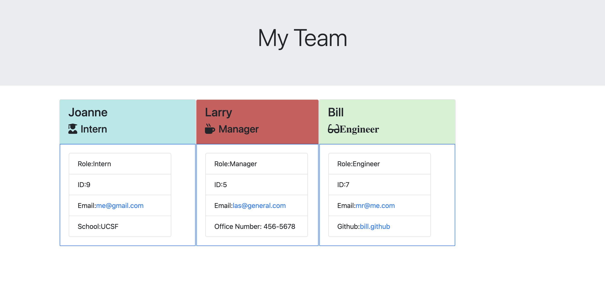

## TEAM PROFILE GENERATOR

# Description

A command-line application that accepts information about employees on a software engineering team and generates an HTML webpage displaying a summary for each person.

# Installation

1. Install node.js
2. Clone or download the source code from GitHub to your local machine
3. Navigate to the root of the downloaded code
4. Open terminal and on command line enter: npm install

# Usage

1. On command line enter: npm start
2. Answer the prompts
3. Navigate to dist folder
4. Open index.html with your browser

# Screenshot

# Video Walkthrough

[Video walkthrough](https://drive.google.com/file/d/13Z7qWNcuKKSvBD_6CuZa5kiJpEkd1Bo_/view?usp=sharing)

# Test

On command line enter: npm test

# Built With

- HTML
- CSS

# License

# Contribution

Made with ❤️ by Joanne Chun
